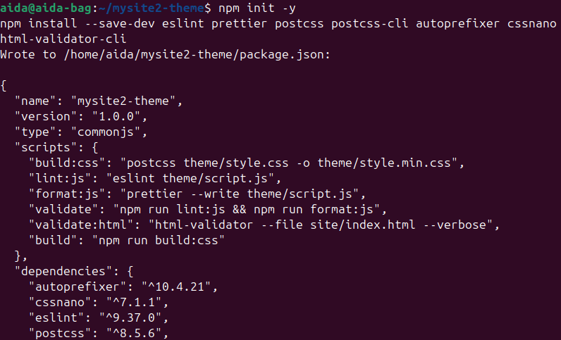
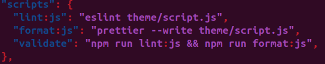
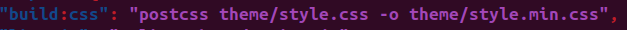
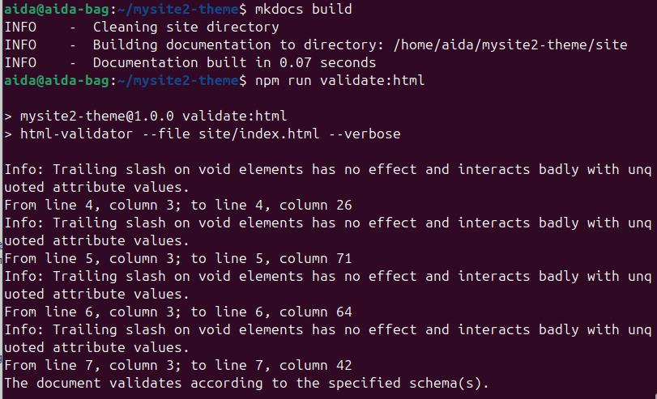

# Задание 2.2. Кастомизация статического сайта (шаблонизация, сборка статики: HTML, CSS, JS)
## 1. Создание собственной темы для сайта MkDocs
### Цель
Создать собственную тему для статического сайта на основе MkDocs, включающую HTML-шаблон, собственные стили CSS и подключение JS-скрипта. Настроить интеграцию Markdown-контента в кастомный шаблон.
### 1.1 Подготовка проекта
За основу был взят репозиторий [mysite2](https://github.com/aidabag/mysite2), созданный в задании 2.1.
Внутри проекта были созданы основные служебные директории. Папка docs содержит исходные файлы страниц сайта в формате Markdown — в частности, главную страницу и раздел “О сайте”. 

В корне проекта размещён конфигурационный файл mkdocs.yml, в котором задаются параметры сайта и указывается путь к пользовательской теме.

Для кастомной темы была создана отдельная папка theme, где хранятся файлы шаблона разметки, таблицы стилей и скрипты. После настройки темы MkDocs генерирует итоговый сайт в директорию site, которая формируется автоматически при сборке проекта.
### 1.2 Создание HTML-шаблона
В папке [theme/](https://github.com/aidabag/mysite2-theme/tree/main/theme) был разработан собственный HTML-шаблон [main.html](https://github.com/aidabag/mysite2-theme/blob/main/theme/main.html), использующий механизм шаблонизации Jinja2. Шаблон содержит:

header с навигацией

main — область основного контента (интеграция Markdown через {{ page.content | safe }})

footer — подвал сайта с копирайтом и метаданными
### 1.3. Подключение темы в MkDocs
В файле mkdocs.yml настроено использование пользовательской темы.
### 1.4. Создание контента
В папке [docs/](https://github.com/aidabag/mysite2-theme/tree/main/docs) размещены страницы:
[index.md](https://github.com/aidabag/mysite2-theme/blob/main/docs/index.md)
[about.md](https://github.com/aidabag/mysite2-theme/blob/main/docs/about.md)
### 1.5. Стилизация и поведение
Файл [style.css](https://github.com/aidabag/mysite2-theme/blob/main/theme/style.css) содержит пользовательские стили для шапки, контента и подвала.

Файл [script.js](https://github.com/aidabag/mysite2-theme/blob/main/theme/script.js) подключён к шаблону и выполняет базовые JS-операции (например, вывод сообщений в консоль).
### 1.6. Результат
После сборки (mkdocs build) и локального запуска (mkdocs serve):

Сайт отображается с кастомной темой;

Стили и скрипт применяются корректно;

Контент Markdown подставляется в шаблон;

Навигация и футер отображаются на всех страницах.

## 2. Валидация, минификация и сборка статики (HTML, CSS, JS)
### Цель
реализовать автоматизированную обработку статических файлов сайта, включая:

проверку качества JavaScript-кода (linting и форматирование);

минификацию и обработку CSS с помощью PostCSS;

проверку валидности HTML-структуры сгенерированных страниц.
### 2.1. Настройка Node.js-среды и зависимостей
Для реализации этапа в проект был инициализирован npm и добавлены необходимые инструменты:

Установленные пакеты выполняют следующие функции:

**ESLint** – проверка кода JavaScript на соответствие стандартам;

**Prettier** – автоматическое форматирование JS-кода;

**PostCSS** + autoprefixer + cssnano – добавление вендорных префиксов и минификация CSS;

**html-validator-cli** – проверка HTML на валидность.

### 2.2. Настройка линтинга и форматирования JS
Создан файл конфигурации [eslint.config.cjs](https://github.com/aidabag/mysite2-theme/blob/main/eslint.config.cjs)
В [package.json](https://github.com/aidabag/mysite2-theme/blob/main/package.json) добавлены скрипты:

Проверка и форматирование выполнялись командой:

Результат: найденные ошибки были автоматически исправлены, код соответствует стандартам.
### 2.3. Минификация и обработка CSS через PostCSS
Создан файл [postcss.config.js](https://github.com/aidabag/mysite2-theme/blob/main/postcss.config.js)

В package.json добавлен скрипт сборки CSS:

Минификация выполняется командой:

Результат: сгенерирован файл style.min.css, который подключён в шаблоне main.html вместо оригинального style.css.

### 2.4. Проверка валидности HTML
После сборки сайта командой mkdocs build валидатор проверяет итоговую страницу: 

(скрипт в package.json:)

Результат: страница прошла проверку на соответствие стандартам HTML. Обнаруженные предупреждения не критичны.

### В рамках пункта 2:

реализована автоматическая проверка и форматирование JS-кода;

настроена минификация CSS с помощью PostCSS;

добавлены автопрефиксы для кроссбраузерной совместимости;

выполнена проверка HTML на корректность и валидность;

сайт собирается в оптимизированном виде (минифицированные стили и проверенный код).

## 3. Автоматизация сборки и деплоя проекта (CI/CD с GitHub Actions)
**Цель** данного этапа — автоматизировать процесс сборки и публикации статического сайта с использованием GitHub Actions и последующим деплоем на GitHub Pages.

### 3.1. Создание и настройка GitHub Actions workflow
В проекте создан файл .github/workflows/deploy.yml, который описывает весь процесс CI/CD.

### 3.2. Настройка токена доступа
Для деплоя на GitHub Pages создан Personal Access Token с правами:

repo

workflow

pages

Токен добавлен в Settings → Secrets → Actions как GHTOKEN2, который используется в CI/CD-пайплайне.

### 3.3. Автоматическая сборка и деплой

После каждого коммита в ветку main запускается workflow, который выполняет следующие действия:

Клонирует репозиторий.

Устанавливает Python и зависимости MkDocs.

Устанавливает Node.js и npm-зависимости для работы с фронтендом.

Валидирует и форматирует JavaScript.

Минифицирует CSS через PostCSS.

Собирает сайт командой mkdocs build.

Публикует содержимое директории site/ в ветке gh-pages.

После успешного выполнения всех шагов сайт автоматически развёрнут на GitHub Pages по адресу: https://aidabag.github.io/mysite2-theme/
