# Отчет по выполнению задания "Создание и развертывание статического сайта"
Подготовила: Багуманова Аида, Р4107

## Установка Python и виртуального окружения

На машине с Ubuntu установим актуальная версию Python, pip и модуль venv с помощью команд:
```bash
sudo apt update
sudo apt install -y python3 python3-venv python3-pip
```
Проверка версии Python:

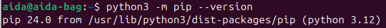

Создание и активация виртуального окружения:

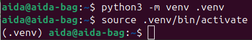

Установка mkdocs:

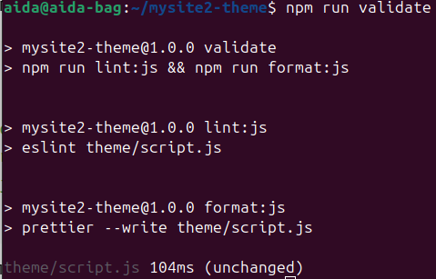

## Создание проекта 
Создание нового проекта MkDocs:

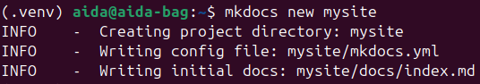

Локальная проверка сайта:

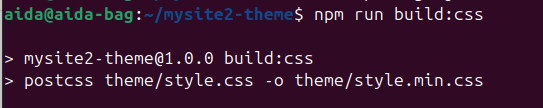

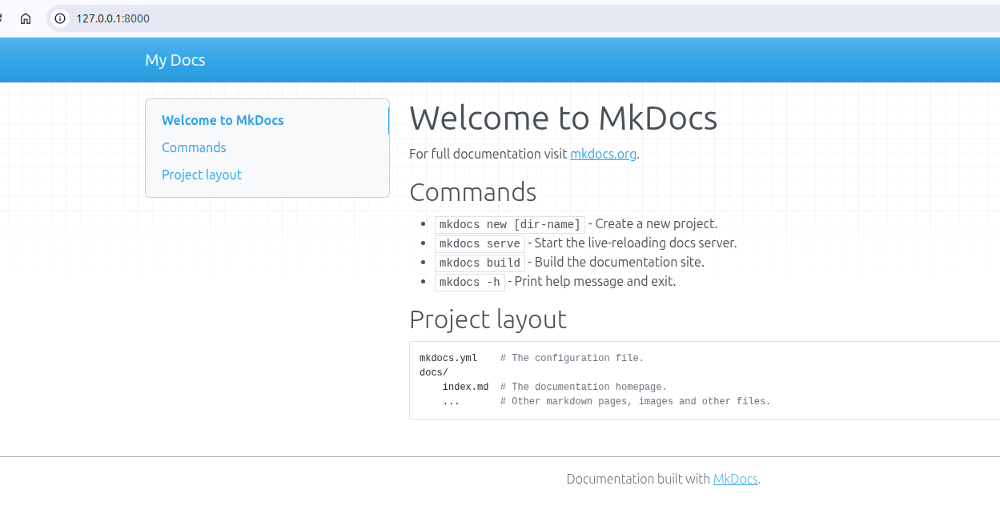

## Работа с Git и GitHub
Создан новый репозиторий на GitHub.
Инициализирован git в локальном проекте:

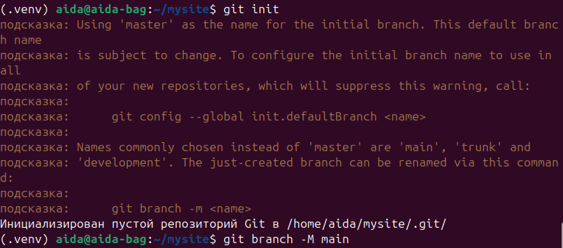

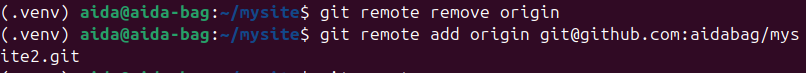

Добавление файлов проекта и коммит:

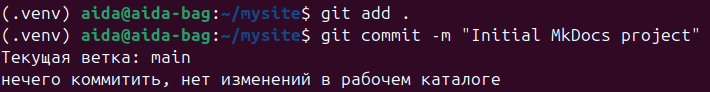

Пуш в репозиторий:

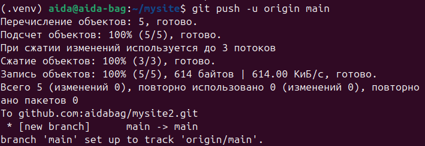

## Публикация сайта на GitHub Pages
Сайт доступен по ссылке: https://aidabag.github.io/mysite2/

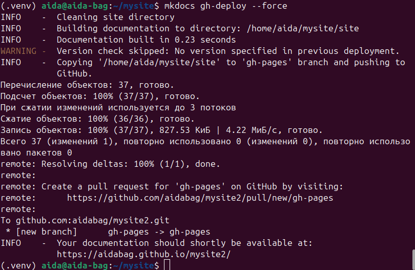

## Автоматический деплой через GitHub Actions
Создан файл .github/workflows/deploy.yml, который запускается при пуше в ветку main.
Для авторизации используется Personal Access Token, сохраненный в секретах репозитория как GHTOKEN
После каждого пуша в main сайт автоматически обновляется на GitHub Pages:

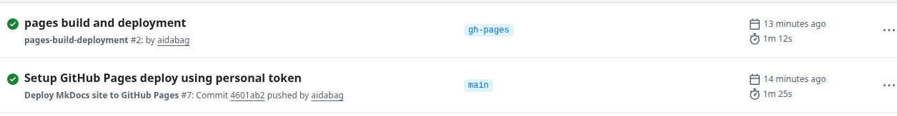

## Исследование возможностей

### 1. Использование отечественных CDN

Цель: ускорить загрузку статического сайта для пользователей в России.  

Примеры:  

- **Яндекс.Облако CDN** — поддержка HTTPS, распределение контента по регионам, интеграция с Object Storage, кэширование HTML, CSS, JS и изображений.  
- **Mail.ru Cloud CDN** — быстрый доступ к статическим ресурсам, настройка TTL для кэширования, интеграция с S3-подобными хранилищами.  
- **Cloudflare Russia** — ускорение доставки файлов, кэширование на ближайших узлах, поддержка SSL и DDoS-защиты.  

Комментарий: использование CDN уменьшает задержки и нагрузку на основной сервер, особенно для больших сайтов и медленных сетей.

---

### 2. Возможности Gitverse для CI/CD

Gitverse (или аналогичные CI/CD сервисы) позволяет:  

- Автоматизировать сборку сайта и деплой при каждом пуше в репозиторий.  
- Подключать тестирование или проверку линтеров перед деплоем.  
- Настраивать уведомления об ошибках сборки для быстрого реагирования.  
- Использовать различные хранилища и облака (GitHub, Helios, Яндекс.Облако, Netlify).  
- Возможность отката к предыдущей версии сайта в случае ошибки сборки.

---

### 3. Варианты деплоя статических сайтов

1. **GitHub Pages** — бесплатный, простая настройка через Actions, автоматический деплой при пуше в main.  
2. **Netlify** — удобная автоматическая публикация с поддержкой CI/CD, можно подключить собственный домен и настроить SSL.  
3. **Helios / Яндекс.Облако** — размещение в российском облаке, поддержка Actions для автоматического деплоя и кэширования через CDN.  
4. **Собственный сервер** — полный контроль над конфигурацией, требуется настройка веб-сервера (Nginx/Apache) и SSL, деплой можно делать через git pull, rsync или скрипты.  

Выбор способа деплоя зависит от требований к скорости, безопасности, удобству обновления и доступности CDN.
